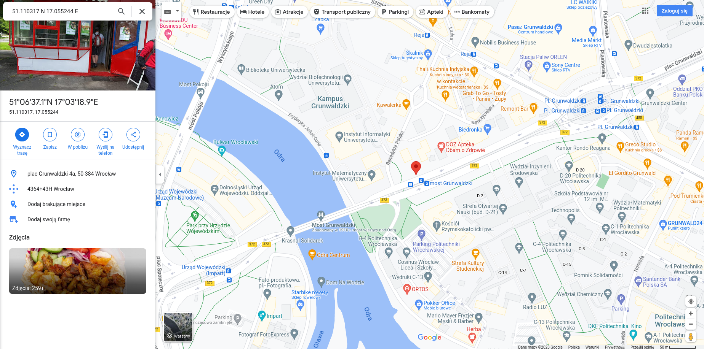

## Solution

Use [`binwalk`](https://github.com/ReFirmLabs/binwalk) to extract ZIP from the image and move to the created by binwalk directory:

```
binwalk -e doner.jpg
cd _doner.jpg.extracted 
```

The ZIP file has password so you need to crack it. We can use [*John the Ripper*](https://github.com/openwall/john) for example:

```
zip2john *.zip > doner.hashes
john doner.hashes 
```

Now, when you have password you can unzip the archive.
```
unzip *.zip
```

You'll get another image. If you use [`exiftool`](https://exiftool.org/), you'll find GPS coordinates:

```
exiftool -c "%6f" tortilla.jpg 
```

The output of this command will be:

```
ExifTool Version Number         : 12.57
File Name                       : tortilla.jpg
Directory                       : .
File Size                       : 74 kB
File Modification Date/Time     : 2023:05:20 21:24:22+02:00
File Access Date/Time           : 2023:05:20 21:38:51+02:00
File Inode Change Date/Time     : 2023:05:20 21:38:51+02:00
File Permissions                : -rw-r--r--
File Type                       : JPEG
File Type Extension             : jpg
MIME Type                       : image/jpeg
Exif Byte Order                 : Big-endian (Motorola, MM)
X Resolution                    : 72
Y Resolution                    : 72
Resolution Unit                 : inches
Y Cb Cr Positioning             : Centered
GPS Version ID                  : 2.3.0.0
GPS Latitude Ref                : North
XMP Toolkit                     : Image::ExifTool 12.57
GPS Longtitude                  : 17.055244 E
Image Width                     : 600
Image Height                    : 420
Encoding Process                : Baseline DCT, Huffman coding
Bits Per Sample                 : 8
Color Components                : 3
Y Cb Cr Sub Sampling            : YCbCr4:2:0 (2 2)
Image Size                      : 600x420
Megapixels                      : 0.252
GPS Latitude                    : 51.110317 N
```

Now go to the Google maps:



Click the pin on the map and search for the flag in *Reviews*


